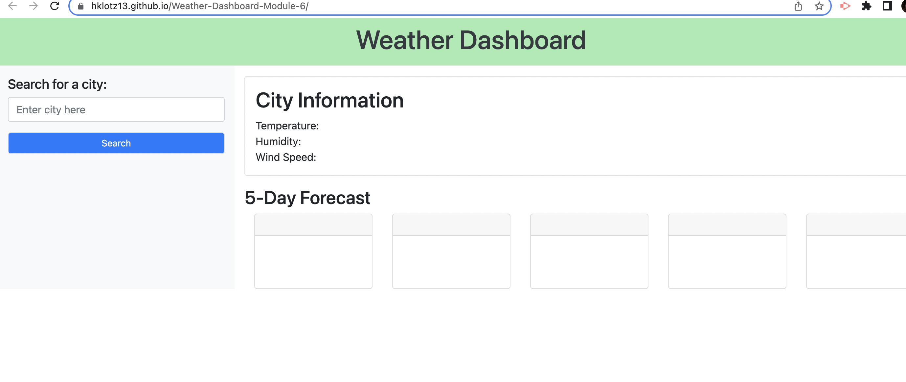

# Weather-Dashboard-Module-6

This site allows the user to search any city and see the current weater conditions (temperature, humidity, and wind speed). The user can also see the forecast for the following five days, along with their search history. 

The deployed application can be found at: https://hklotz13.github.io/Weather-Dashboard-Module-6/

KNOWN ISSUES:
 - API does not connect properly
 - Search history does not save
 
